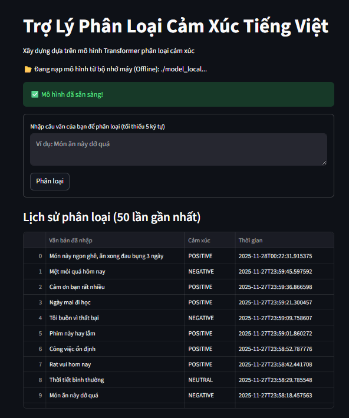

<h1 align="center">  <span> 🤖 Trợ Lý Phân Loại Cảm Xúc Tiếng Việt 🤖</span></h1
Xây dựng một ứng dụng web đơn giản bằng Streamlit để phân loại cảm xúc (Tích cực, Tiêu cực, Trung tính) từ văn bản tiếng Việt do người dùng nhập vào.



## 🚀 Tính năng chính

* Giao diện web tương tác, đơn giản được xây dựng bằng **Streamlit**.
* Phân loại cảm xúc thành 3 nhãn: **POSITIVE, NEGATIVE, NEUTRAL**.
* Sử dụng mô hình Transformer (PhoBERT) đã được fine-tune từ **Hugging Face**.
* Lưu trữ lịch sử phân loại (văn bản, nhãn cảm xúc, thời gian) vào CSDL **SQLite**.
* Hiển thị 50 kết quả phân loại gần nhất ra giao diện nếu như nhiều hơn thì bấm tải thêm.
* Xử lý và thông báo lỗi cho đầu vào không hợp lệ (ví dụ: câu dưới 5 ký tự).


## 🛠️ Công nghệ sử dụng

* Python
* Streamlit (Giao diện web)
* Transformers (Hugging Face)
* Pandas (Hiển thị lịch sử)
* SQLite3 (Cơ sở dữ liệu)

## 📂 Cấu trúc dự án

```
Vietnamese_Emotion_Classification/
├── app.py                    # Ứng dụng Streamlit
├── nlp.py                    # Chứa hàm tải mô hình (load model)
├── database.py               # Chứa các hàm CSDL
├── requirements.txt          
└── README.md                
```

## ⚙️ Cài đặt

1.  Clone repository (hoặc tải mã nguồn về).
2.  Cài đặt các thư viện cần thiết:

```bash
pip install -r requirements.txt
```

## 🏃 Sử dụng

```bash
streamlit run app.py
```

## Tác giả

* **NGUYỄN TIẾN THỌ**

## Đóng góp

Mọi đóng góp đều được hoan nghênh! Vui lòng tạo issue hoặc pull request để đóng góp.

